# June 21: project start

started the mp3 player project. wanted a portable player that can play files off an sd card, has fm radio, and looks cool with leds.
chose the stm32h743vit6 as the main mcu because it has enough ram for audio buffering, lots of peripherals for all the features, and runs at 480mhz so it should be fast enough for anything i throw at it.
picked the cs43131 for the audio dac since it has a built-in headphone amp and sounds great.
going with apa102-2020 leds because they're easy to drive and small enough for a dense array.
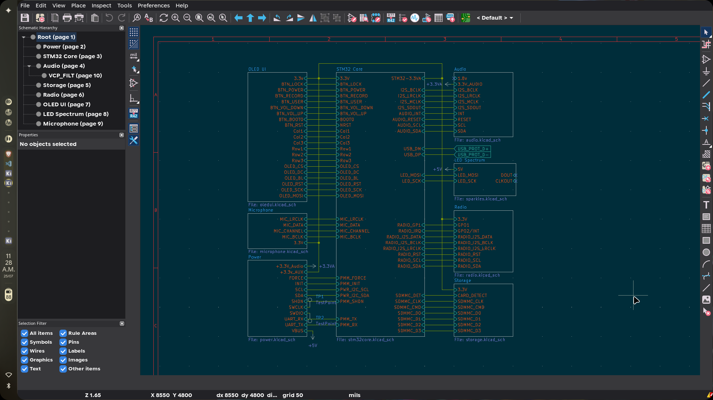

**Total time spent: 3 hours**

# June 22: schematic - mcu core

drew out the stm32h743 and core circuitry.
8mhz hse crystal and 32.768khz lse crystal for the rtc.
all the decoupling caps on the power pins - there are a lot on this chip.
boot0 and nrst pullups, swd header for programming.
started mapping out which peripherals go on which pins based on the alternate function table.
this chip has so many pins it took a while to figure out the best layout.
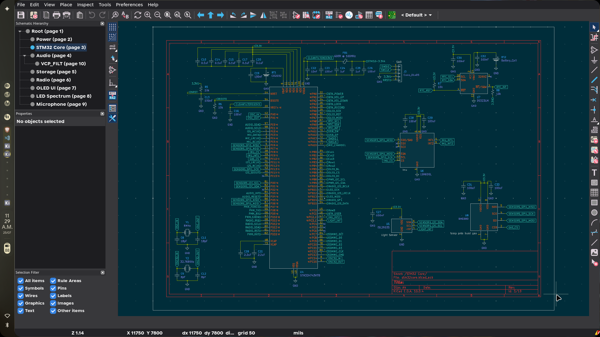

**Total time spent: 5 hours**

# June 23: schematic - power and sensors

added the power section. usb-c connector with cc resistors for ufp detection.
esd protection with usblc6 on the data lines.
was going to use a discrete power stage but decided to go with a pmm module instead - it handles charging, buck-boost, and regulation all in one.
added the tps7a4701 ultra-low-noise ldo for the analog/audio supply and tlv70233 for the digital 3.3v rail.
placed the sensors on the mcu core sheet - lsm6dsl imu, bme680 environmental sensor, and isl29035 light sensor.
the lsm6dsl and bme680 share an spi bus with individual chip selects.
isl29035 is on its own i2c bus.
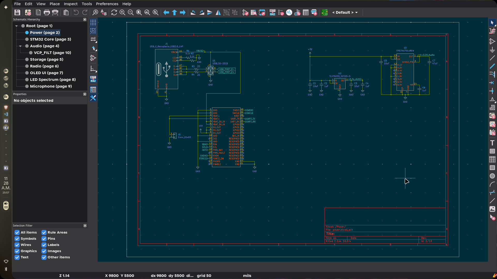

**Total time spent: 6 hours**

# June 24: schematic - audio and radio

drew the audio section with the cs43131.
connected it to sai1 for i2s audio data and i2c4 for control registers.
added the vcp filter capacitor sub-circuit for the charge pump.
headphone output with dc-blocking caps.
added the si4735 fm radio module - it outputs i2s audio data directly, so it goes on sai2.
radio has its own i2c bus for tuning and control, plus an irq line for rds data ready.
added two antenna connectors with a solder jumper to select between them.
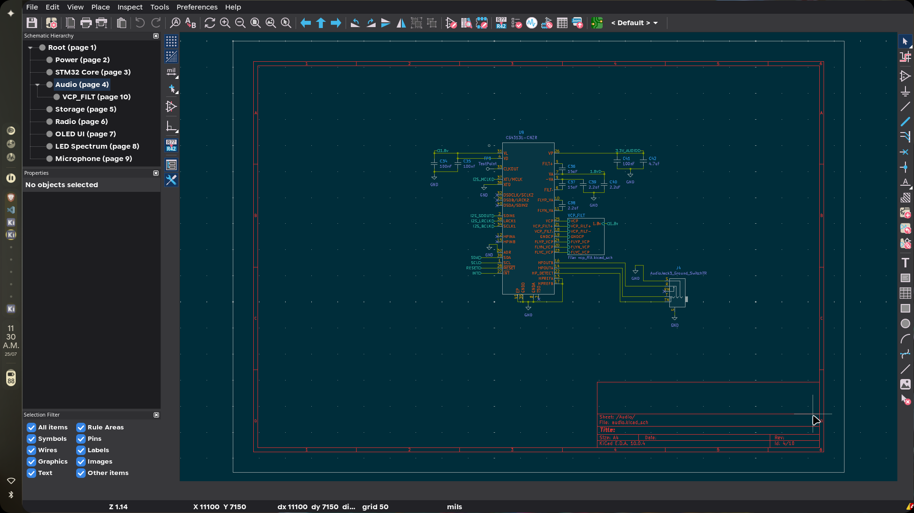
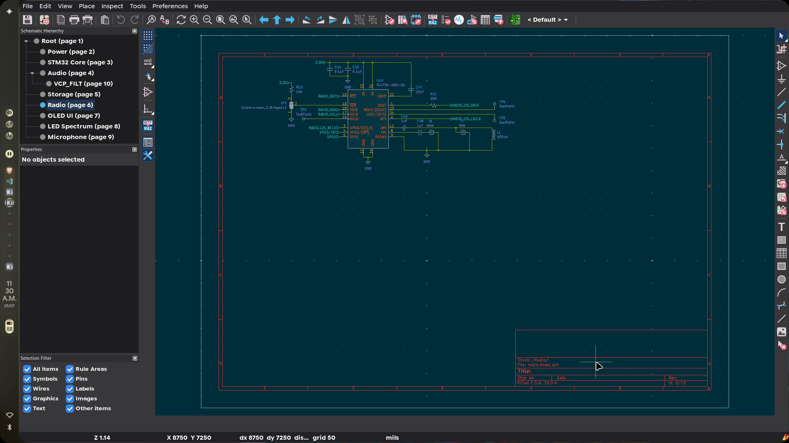
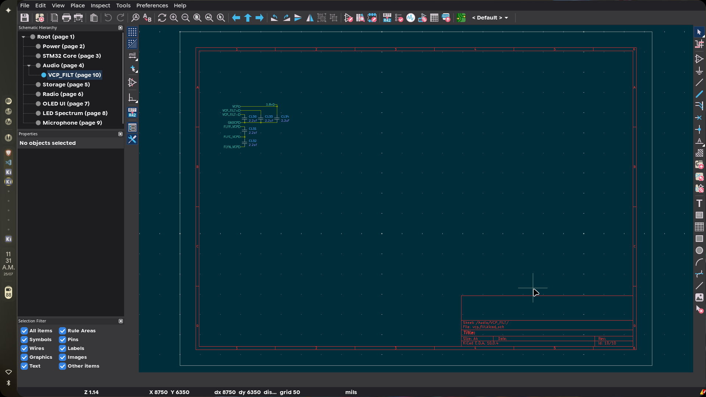

**Total time spent: 5 hours**

# June 25: schematic - storage, oled, microphone

added the micro sd card slot with 4-bit sdmmc interface.
card detect pin on pc7.
drew the oled display connector - 8-pin header with spi interface.
designed the button matrix - 3x3 matrix for the main navigation buttons plus 6 direct buttons for power, volume, record, lock, boot0, and user.
added esd protection diodes on all button inputs.
placed the ics-43434 mems microphone - it outputs i2s directly so it connects to a sai block.
mic has a channel select pin for stereo/mono configuration.
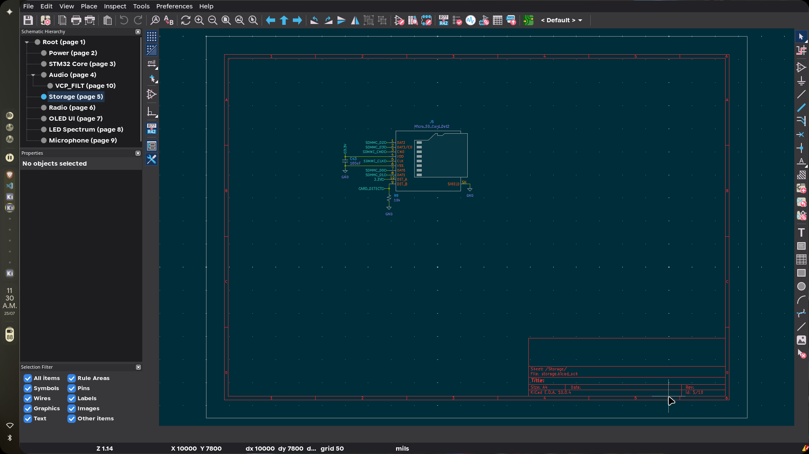
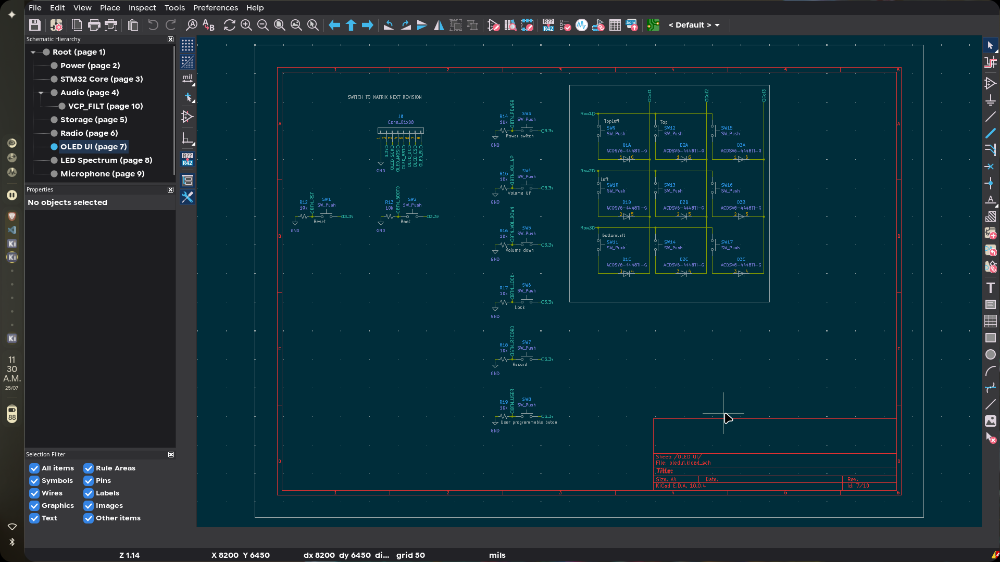
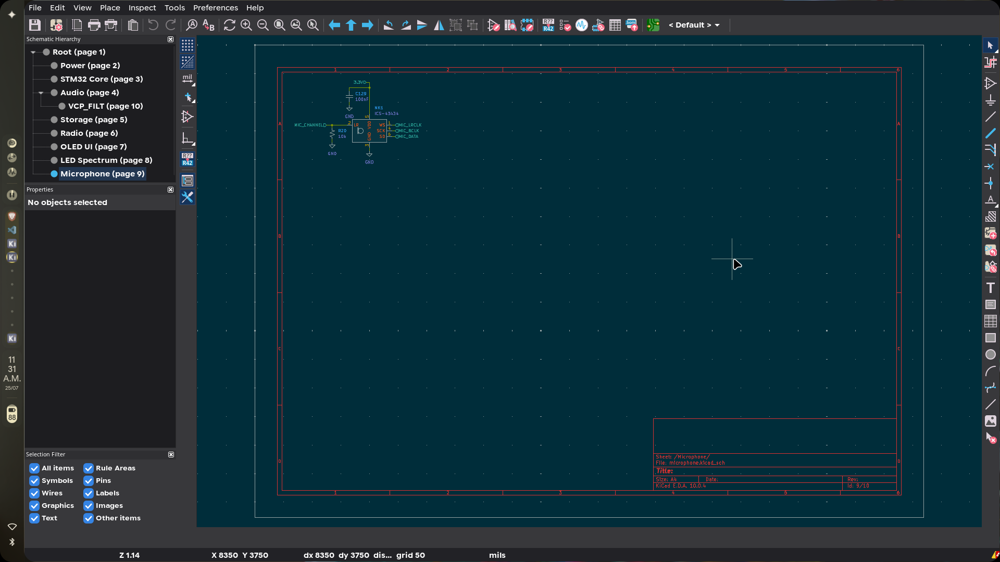

**Total time spent: 5 hours**

# June 26: schematic - leds

added the apa102-2020 led arrays.
70 leds total split across two sheets - 35 for the sparkle effects and 35 for the spectrum analyzer bar.
daisy-chained data connection between all leds.
each led has a 100nf decoupling cap.
powered from the 5v rail since apa102s have internal current regulation.
the data and clock lines come from spi-like bitbanging on two gpio pins.
this took longer than expected because of the sheer number of components to place.
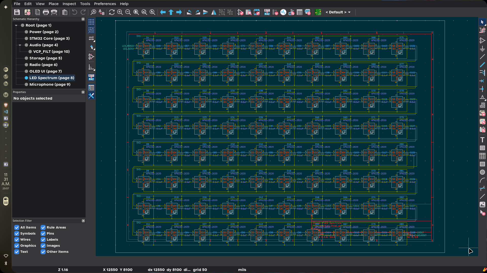

**Total time spent: 6 hours**

# June 28: schematic - pmm integration

started integrating the pmm (power management module) properly.
the pmm is an stm32-based module that handles battery charging, buck-boost conversion, and power sequencing.
it communicates with the main mcu over uart for status and i2c for configuration.
has digital pins for force-on, shutdown, and init signals.
moved the pmm symbol to a better position on the power sheet and started wiring up all 40 pins.
23 pins are no-connects (reserved, gpio, nrst, adc_in, fault, enable, pgood, 3v3 output).

**Total time spent: 4 hours**

# June 29: schematic - pmm wiring and top-level

finished wiring the pmm module.
connected all the signal pins - uart tx/rx, i2c sda/scl, shutdown, force, init.
added hierarchical labels on the power sheet for all the signals that go to the mcu core.
redesigned the top-level power sheet pins to match the pmm's native signal names instead of the old generic names.
the power sheet now exposes 12 pins: +3.3v_audio, +3.3v_aux, force, init, scl, sda, shdn, swclk, swdio, uart_rx, uart_tx, vbus.
connected gnd pins on both sides to ground symbols.
wired the vbat+ and 5v_out pins to the appropriate power rails.
the schematic is almost done now - just need to do a final review and drc pass.

**Total time spent: 5 hours**

# July 22: schematic review

did a review of all schematic sheets.
caught a few issues - some net names were inconsistent between sheets, fixed those.
the sensors sheet was missing its hierarchical labels so it was essentially disconnected.
schematic is in good shape now, probably 95% complete.

**Total time spent: 3 hours**

# July 25: firmware skeleton

decided to start on the firmware while waiting for motivation to finish the schematic.
set up a platformio project targeting the stm32h743vit6 with the stm32cube framework.
wrote the full pin definitions header from the schematic - all 96 pins mapped.
configured the system clock at 480mhz from the 8mhz hse crystal with pll1.
set up pll2 for audio clock generation.
initialized all the i2c buses (sensors, pmm, rtc, audio), spi buses (oled, sensors), and uart (pmm debug).
wrote the hal msp callbacks for pin muxing on all peripherals.
gpio init sets up all the button inputs, chip selects, control outputs, and sd card detect.
firmware compiles clean - 14.9kb flash, 2.3kb ram used.
wrote the readme for both the firmware and the full project.
created this journal.
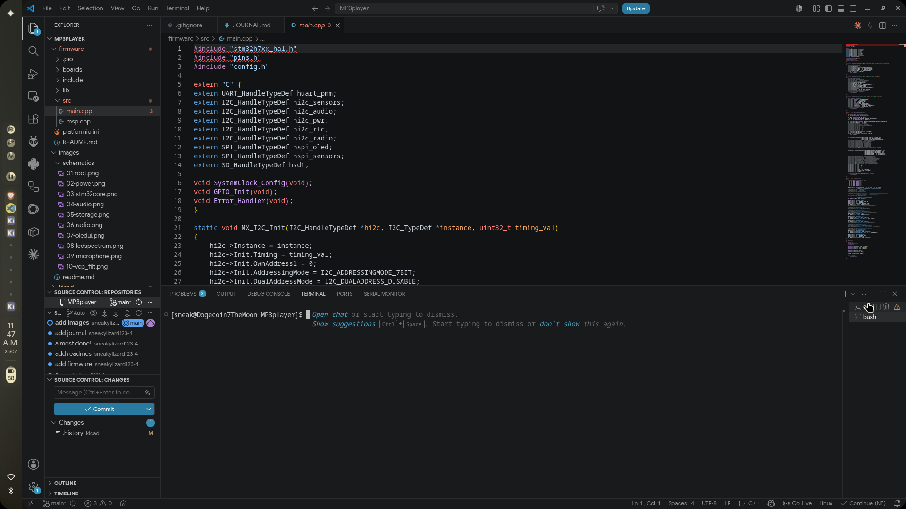

**Total time spent: 4 hours**

# July 26: schematic rework

major rework of the power section. ditched the pmm module entirely - it was overkill for what we actually need.
replaced it with a discrete bq24090dchg battery charger (1a single-cell li-ion) with ntc thermistor monitoring and charge led.
added a tps613222adbv boost converter to step the battery up to 5v for the apa102 leds.
kept the tps7a4701 and tlv70233 regulators for the analog and digital 3.3v rails.
the power sheet is much simpler now - just 3 pins out: +3.3v_audio, +3.3v_aux, and vbus. no more uart/i2c control interface.
removed the cr2032 battery cell and backup battery from the mcu core sheet.
merged the sensors into the stm32core sheet directly - no more separate sensors sheet.
removed the vcp filter sheet - those caps are now inline on the power sheet.
renamed the sparkles sheet to led spectrum and simplified it heavily.
changed the crystal load caps from 18pf to 12pf for better stability.
swapped testpoints for mounting holes on the root sheet.
button switches changed to acdsv6-4448ti-g tactile switches.
schematic is now 8 sheets, down from 12. much cleaner.

**Total time spent: 5 hours**

# July 27: pcb layout

laid out the board in kicad. 6-layer stackup with 2 internal power planes, 1.6mm thickness.
roughly 50x70mm form factor for a portable handheld player.
routed all the high-speed interfaces first - sdmmc for the sd card, sai/i2s for audio and mic, and the usb differential pair.
kept the analog audio section separated from the digital and power sections.
placed the cs43131 dac close to the headphone jack to minimize analog trace lengths.
bq24090dgq charger and tps613222adbv boost on the power section with proper thermal pad stitching.
apa102 leds arranged along the bottom and right edges for the spectrum bar.
oled display connector at the top edge for a flip-up screen.
button matrix traces routed efficiently through the center.
mounting holes in the corners for enclosure mounting.
ran a full drc pass - all clearance and creepage rules pass. no unconnected nets.

**Total time spent: 6 hours**

# July 28: pcb silkscreen

fixed small silkscreen errors and added penguin
kicad keeps crashing for some reason, probably due to wayland errors
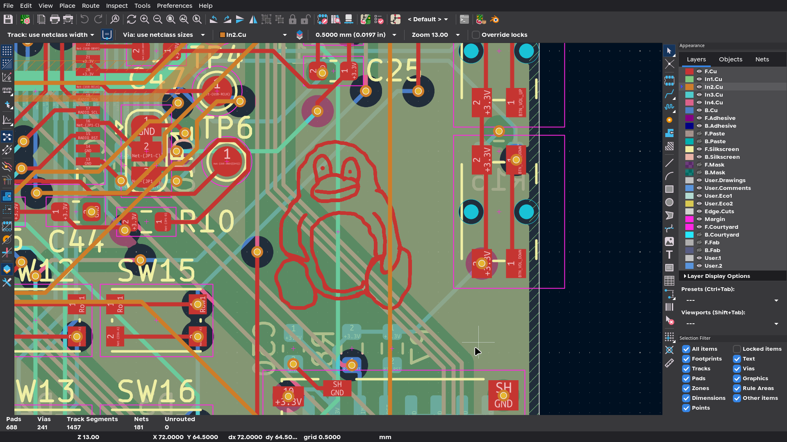
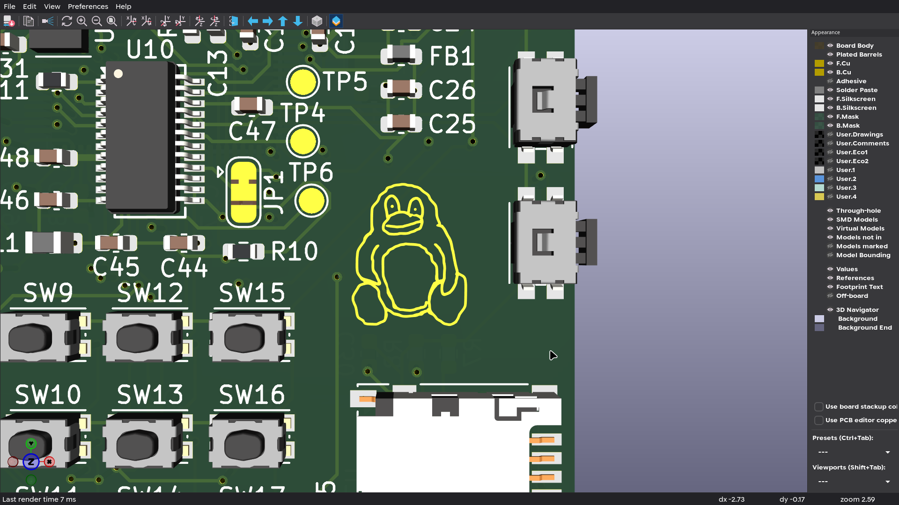