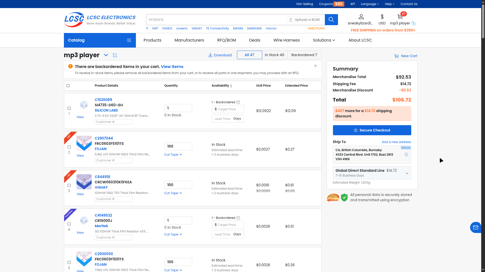

# June 21: project start

started the mp3 player project. the plan was a portable player that can play files off an sd card, has fm radio, and looks cool with leds.

spent most of the time on part selection rather than actual designing. went back and forth on the mcu a lot - considered an esp32 but the thought of audio buffering while also driving a display and every peripheral on one chip made me nervous. settled on the stm32h743vit6 because it has 1mb of ram (enough to double buffer audio without sweating), a huge number of peripherals so every feature can have its own bus, and 480mhz so it's never the bottleneck. the downside is it's a pain to solder (lqfp-100) but i have a stencil so it's fine.

for the dac i picked the cs43131 because it has a built-in headphone amp so i don't need a separate one, and it sounds genuinely great. it also takes i2s directly which keeps the interface simple.

leds are apa102-2020 - only need clock and data lines which makes them easy to drive, they're tiny (2mm square) so i can pack a bunch in, and each one has its own pwm controller so no multiplexing nightmare.

**Total time spent: 3 hours**

# June 22: schematic - mcu core

drew out the stm32h743 and all the core circuitry. this is the sheet everything else hangs off so i wanted to get it right.

started with the clocks. 8mhz hse crystal feeds the pll to run the chip at 480mhz, plus a 32.768khz lse crystal for the rtc so it keeps time when the device is off. put load caps on both - i remember reading that crystal load caps matter a lot for startup reliability, so i didn't skip them.

then the boring but important stuff: decoupling caps on every power pin. this chip has vdda, logic vdd, plus vcap pins for the internal voltage regulator, and i lost count of how many 100nf caps i placed. i grouped them as close to the pins as i could.

added the boot0 resistor so the chip boots from flash, an nrst pullup so reset is clean, and the swd header for programming. double checked the swd pin muxing because it's so easy to swap swclk and swdio.

the annoying part was mapping peripherals to pins. i started going through the alternate function table to figure out which pins can do i2c, spi, sai, sdmmc, etc. this chip has so many pins and nearly every one has like 4 alternate functions, so i kept going back and forth between pins. got a rough plan down for the main buses but i know i'll be redoing some of this as i add more sheets.

**Total time spent: 5 hours**

# June 23: schematic - power and sensors

added the power section. usb-c connector with the cc resistors set up for ufp so the charger sees the board as a device. threw usblc6 esd protection on the data lines since usb is the thing that gets touched the most.

this is where i made my first big decision that i'd regret later. i was going to build a discrete power stage (separate charger + converters) but decided to go with a pmm module instead - an stm32-based module that handles charging, buck-boost, and power sequencing all in one. it sounded great on paper: less work for me, one module does everything, and it talks to the main mcu over uart/i2c for status and config. it has force-on, shutdown, and init pins for power control.

added the tps7a4701 ultra-low-noise ldo for the analog/audio supply and a tlv70233 for the digital 3.3v rail, so the analog side isn't fed from the same noisy rail as everything digital.

placed the sensors on the mcu core sheet. the lsm6dsl imu and bme680 share an spi bus with individual chip selects (cheap on pins, and neither needs continuous bandwidth). isl29035 light sensor went on its own i2c bus since it's so low bandwidth. i wanted the sensors off i2c to keep the i2c buses free for audio/radio control which is more timing sensitive.

**Total time spent: 6 hours**

# June 24: schematic - audio and radio

drew the audio section with the cs43131. it connects to sai1 for the i2s audio data and i2c4 for the control registers - i deliberately gave the dac its own i2c bus so tuning the radio or polling sensors never interferes with audio configuration.

added the vcp filter capacitor sub-circuit for the dac's charge pump. the cs43131 runs on an internal charge pump and those caps are critical for clean supply voltage, so i didn't cheap out on the values. headphone output has dc-blocking caps to keep dc off the headphones.

then the si4735 fm radio. this chip outputs i2s audio data directly, which is super convenient - it goes on sai2 so the radio and dac each have their own sai block and the mcu just switches the source. radio has its own i2c bus for tuning and control, plus an irq line for rds data ready (station name, metadata, etc).

added two antenna connectors with a solder jumper to pick between them - one for a whip antenna, one for an external/helical, because i wasn't sure yet which one the enclosure would fit. a solder jumper lets me decide later without a board spin.

**Total time spent: 5 hours**

# June 25: schematic - storage, oled, microphone

added the micro sd card slot with the 4-bit sdmmc interface. 4-bit is noticeably faster than spi mode and the stm32h743 has a proper sdmmc peripheral so it's basically free. card detect on pc7 so firmware can watch for card insert/remove.

drew the oled display connector - an 8-pin header with spi interface. spi is plenty for a small display and leaves the i2c/sai buses free for audio.

designed the button matrix. 3x3 matrix for the main navigation buttons to save gpio, plus 6 direct buttons for power, volume, record, lock, boot0, and user. direct buttons for the ones that either need interrupts or can't tolerate scanning latency (power especially). added esd protection diodes on all the button inputs since buttons are a prime static entry point.

placed the ics-43434 mems microphone - it outputs i2s directly so it plugs into another sai block. it has a channel select pin so i can put it on the left or right channel, which gives flexibility for stereo/mono config later.

**Total time spent: 5 hours**

# June 26: schematic - leds

added the apa102-2020 led arrays. 70 leds total split across two sheets - 35 for the sparkle effects and 35 for the spectrum analyzer bar. data lines are daisy-chained through all of them, so one data + one clock pin drives the whole lot.

each led gets a 100nf decoupling cap right next to it. with 70 leds that's 70 caps and this sheet probably took twice as long as any other just from the sheer number of components to place. all leds are powered from the 5v rail since apa102s have internal current regulation and 5v gives more headroom for accurate colors.

the data and clock lines come from two gpio pins bit-banging the apa102 protocol. i thought about using a hardware spi peripheral but the apa102 protocol isn't exactly spi, and bit-banging two pins on a 480mhz chip is plenty fast to drive the whole chain. it also keeps the real spi peripheral free for the oled and sensors.

definitely the most tedious sheet.

**Total time spent: 6 hours**

# June 28: schematic - pmm integration

started integrating the pmm module properly. it's an stm32-based module that handles battery charging, buck-boost conversion, and power sequencing. it communicates with the main mcu over uart for status and i2c for configuration, and has digital pins for force-on, shutdown, and init signals.

moved the pmm symbol to a better spot on the power sheet and started wiring up all 40 pins. 23 of them are no-connects (reserved pins, extra gpio, nrst, adc_in, fault, enable, pgood, and even a 3v3 output i wasn't using). it felt wrong leaving a third of the pins floating, but with a module like this you take what you're given.

this is where the pmm started to feel more like a burden than a help. every connection had to go through its pin mapping, i couldn't rename any of its signals, and i kept second-guessing the power sequencing.

**Total time spent: 4 hours**

# June 29: schematic - pmm wiring and top-level

finished wiring the pmm module. connected all the signal pins - uart tx/rx, i2c sda/scl, shutdown, force, init. added hierarchical labels on the power sheet for everything going to the mcu core, and redesigned the top-level sheet pins to match the pmm's native signal names instead of the generic names i'd used before.

the power sheet now exposes 12 pins: +3.3v_audio, +3.3v_aux, force, init, scl, sda, shdn, swclk, swdio, uart_rx, uart_tx, vbus. connected the gnd pins on both sides to ground symbols and wired vbat+ and 5v_out to the appropriate rails.

the schematic was basically done after this - just needed a final review and drc pass. looking back, i should've done that review sooner, because the pmm turned out to be a mistake i'd rip out a few weeks later.

**Total time spent: 5 hours**

# July 22: schematic review

full disclosure: there was a long gap here. i got busy with school stuff and didn't touch the project for weeks. the schematic just sat at "done" the whole time.

when i came back i did a careful review of all the sheets and it paid off immediately. caught a few net names that were inconsistent between sheets and fixed those. but the big one: the sensors sheet was missing its hierarchical labels, so it was essentially disconnected from the rest of the design. it would've been a nightmare to debug on the bench, and i only caught it because i actually clicked through every sheet instead of trusting that it worked.

spent the rest of the time running erc and tracing every net to make sure the connections were actually right. schematic is in good shape now, probably 95% complete.

**Total time spent: 3 hours**

# July 25: firmware skeleton

decided to start on the firmware while waiting for motivation to finish the schematic. nice change of pace from kicad.

set up a platformio project targeting the stm32h743vit6 with the stm32cube framework. wrote the full pin definitions header from the schematic - all 96 pins mapped to their alternate functions.

configured the system clock at 480mhz from the 8mhz hse crystal using pll1. that's the stm32h7 clocking rabbit hole - there are like 3 plls and a whole routing matrix, and i definitely read the reference manual too many times. set up pll2 for audio clock generation too, so the sai can run at a clean multiple for the dac.

initialized all the i2c buses (sensors, pmm, rtc, audio), spi buses (oled, sensors), and uart (pmm debug). wrote the hal msp callbacks for pin muxing on all the peripherals, and gpio init sets up all the button inputs, chip selects, control outputs, and sd card detect.

firmware compiles clean - 14.9kb flash, 2.3kb ram used. basically an empty shell, but it proves the clock, buses, and pins are all configured right. also wrote the readme for both the firmware and the full project, and created this journal.

**Total time spent: 4 hours**

# July 26: schematic rework

major rework of the power section. ditched the pmm module entirely - the more i thought about it, the more it was overkill for what we actually need. it added a whole extra mcu and a uart/i2c protocol just to do what a couple of dedicated chips do more simply. simpler to understand, cheaper, and fewer ways to fail.

replaced it with a discrete bq24090 battery charger (1a single-cell li-ion) with ntc thermistor monitoring and a charge led. added a tps613222adbv boost converter to step the battery up to 5v for the apa102 leds. kept the tps7a4701 and tlv70233 regulators for the analog and digital 3.3v rails.

the power sheet is much simpler now - just 3 pins out: +3.3v_audio, +3.3v_aux, and vbus. no more uart/i2c control interface, no more sequencing pins.

while i was at it i cleaned up a bunch of other stuff: removed the cr2032 battery cell and its backup circuitry from the mcu core sheet (the rtc just runs off the main battery when the device is on - one less thing to change), merged the sensors into the stm32core sheet directly, removed the vcp filter sheet (those caps are now inline on the power sheet), renamed the sparkles sheet to led spectrum and simplified it heavily, changed the crystal load caps from 18pf to 12pf for better stability, swapped testpoints for mounting holes on the root sheet, and changed the button switches to acdsv6-4448ti-g tactile switches.

schematic is now 8 sheets, down from 12. much cleaner.

**Total time spent: 5 hours**

# July 27: pcb layout

laid out the board in kicad. 6-layer stackup with 2 internal power planes, 1.6mm thickness, roughly 50x70mm for a portable handheld player. the extra layers were a bit of a luxury but they make routing so much easier and keep the supply impedance low.

routed the high-speed interfaces first - sdmmc for the sd card, sai/i2s for audio and mic, and the usb differential pair. i figured if those couldn't get clean routes i'd need to rethink pin assignments before doing anything else.

kept the analog audio section separated from the digital and power sections, and placed the cs43131 dac close to the headphone jack to keep the analog trace lengths short. the bq24090 charger and tps613222adbv boost went in the power section with thermal pad stitching under the chips. apa102 leds are arranged along the bottom and right edges for the spectrum bar, oled connector at the top edge for a flip-up screen, and the button matrix routed through the center.

mounting holes in the corners for the enclosure. ran a full drc pass at the end - all clearance and creepage rules pass, no unconnected nets. felt like a real milestone.

**Total time spent: 6 hours**

# July 28: pcb silkscreen

fixed up the silkscreen layer - a bunch of reference designators were overlapping and unreadable, so i adjusted text sizes and positions across the whole board. added a penguin easter egg on the bottom copper layer, visible through the solder mask. clearly the most important part of the project.

kicad keeps crashing every few minutes, probably due to wayland rendering issues. had to save after basically every change, which drove me insane.

ran a final design rule check - all clear - and did a 3d render to check the board appearance. pcb is ready for fabrication.

**Total time spent: 1 hour**

# July 29: cart

started the bom export and lcsc part picking. exported the bom from kicad and started hunting down every part on lcsc.

had to change the antenna inductor because there are no 450uh 0805 signal inductors - switched to a 1206 470uh to match common values. this kind of thing happens a lot when sourcing: the schematic value is fine but nobody stocks it in that package, so you adjust and move on.

kicad isn't crashing anymore?? not complaining.

bom is a little expensive though, so i'll need to swap in parts i might already have in the parts drawer and find some cheaper equivalents.

**Total time spent: 2 hours**

# July 30: trace fixes

went back and re-examined the routing. some traces were quite wobbly from when i first routed them and weren't great for high-speed signals - lots of unnecessary zigzags that add stub length and impedance discontinuities.

the fix took a while because there are lots of vias on the pcb and every straight line had to thread between them. i went trace by trace through the sdmmc and i2s lines especially, and they're reasonably straight now with way less wobble.

honestly this was quite therapeutic and relaxing. 9/10 activity, would recommend.

**Total time spent: 2 hours**

# July 31: via optimisation

optimized via placement to free up space and make room for traces. a lot of vias were just dropped wherever they landed, so i moved them into tidy columns and out of the way of routing channels, and trimmed the ones i didn't need.

added some extra vias to help with emi near the power stage - stitching vias around the boost converter's switching area so return currents have a low-impedance path. might add some more near the audio and radio stages too, i'll see how it looks on the next review.

**Total time spent: 3 hours**

# August 1: readme polish

fixed the readme as specified by reviewers - they wanted it to explain what the sensors actually do and to follow the readme guide. added an overview and gallery to the readme along with assembly and firmware instructions, and made sure the bom table was in there.

**Total time spent: 1 hour**
