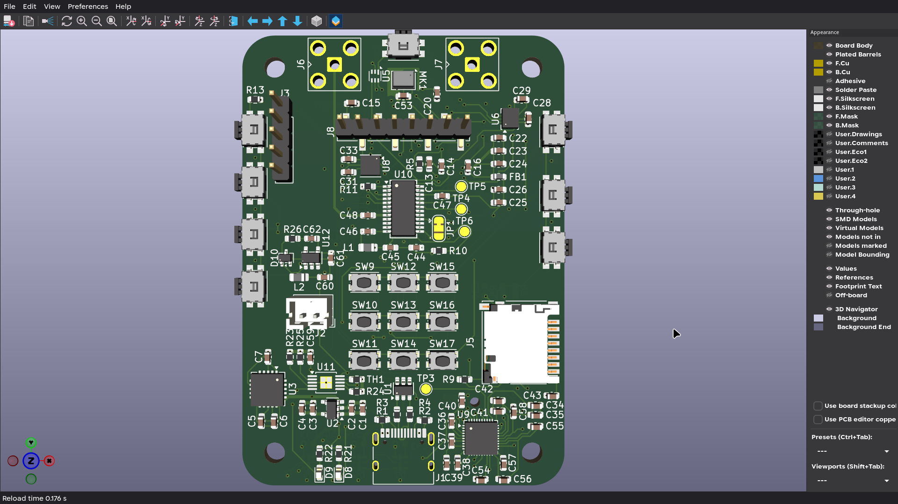
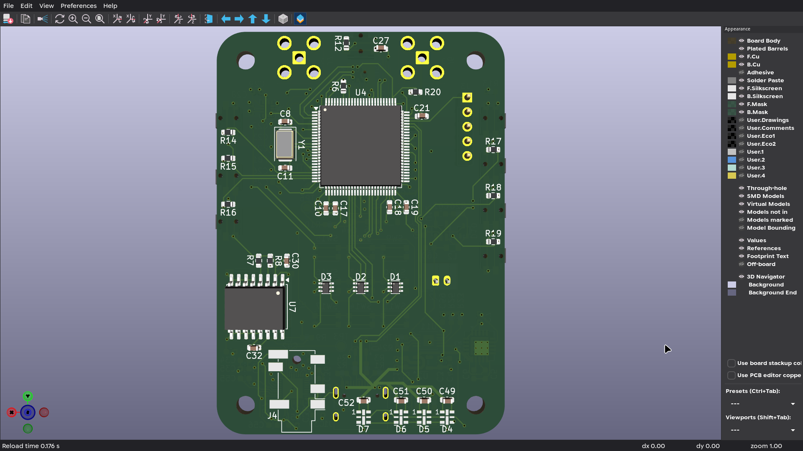

# MP3 Player

A portable MP3 player built around the STM32H743VIT6, designed in KiCad 10 with PlatformIO firmware.

## Features

- CS43131 headphone DAC with integrated amp
- Si4735 FM radio receiver
- ICS-43434 MEMS microphone
- Micro SD card storage (4-bit SDMMC)
- OLED display with button UI (3x3 matrix + direct buttons)
- APA102 RGB LEDs (spectrum bar)
- LSM6DSL IMU, BME680 environmental sensor, ISL29035 light sensor
- DS3231M RTC
- USB 2.0 (USB-C)
- BQ24090DGQ battery charger with NTC thermistor monitoring
- TPS613222ADBV boost converter (battery to 5V)
- Ultra-low-noise TPS7A4701 LDO for audio, TLV70233 for digital

## Project Layout

```
MP3player/
├── kicad/                      # KiCad 10 schematics + PCB
│   ├── MP3player.kicad_sch     # Root — 8 hierarchical sheets
│   ├── stm32core.kicad_sch     # MCU, sensors, IMU, light, gas, RTC
│   ├── power.kicad_sch         # USB-C, BQ24090, boost, LDOs, ESD
│   ├── audio.kicad_sch         # CS43131 DAC, headphone amp
│   ├── storage.kicad_sch       # Micro SD card slot
│   ├── oledui.kicad_sch        # OLED display + buttons
│   ├── radio.kicad_sch         # Si4735 FM radio
│   ├── microphone.kicad_sch    # ICS-43434 I2S mic
│   ├── sparkles.kicad_sch      # APA102 LED strip (spectrum bar)
│   └── parts/                  # Custom footprints
│
├── firmware/                   # PlatformIO firmware
│   ├── platformio.ini          # Build config (ststm32 + stm32cube)
│   ├── include/
│   │   ├── stm32h7xx_hal_conf.h
│   │   ├── pins.h              # Pin assignments from schematic
│   │   └── config.h
│   └── src/
│       ├── main.cpp            # Clock, peripheral init, main loop
│       └── msp.cpp             # HAL MSP callbacks
│
└── README.md
```

## Schematic Sheets

| Sheet | File | Description | Key Components |
|-------|------|-------------|----------------|
| Root | MP3player.kicad_sch | Hierarchical sheet definitions | Mounting holes, power symbols |
| STM32 Core | stm32core.kicad_sch | MCU + onboard sensors | STM32H743, LSM6DSL, BME680, ISL29035, DS3231M |
| Power | power.kicad_sch | USB-C input, charger, regulators | BQ24090DGQ, TPS613222ADBV, TPS7A4701, TLV70233, USBLC6 |
| Audio | audio.kicad_sch | Headphone output | CS43131-CNZR |
| Storage | storage.kicad_sch | SD card slot | Micro SD (DM3) |
| OLED UI | oledui.kicad_sch | Display + button matrix | OLED, 13 buttons (ACDSV6-4448TI-G) |
| Radio | radio.kicad_sch | FM/AM receiver | Si4735-D60-GU |
| Microphone | microphone.kicad_sch | I2S MEMS mic | ICS-43434 |
| LED Spectrum | sparkles.kicad_sch | APA102 LED strip | APA102-2020 |

## Firmware

Built with [PlatformIO](https://platformio.org/) using the STM32 HAL (stm32cube framework).

### Prerequisites

- [PlatformIO CLI](https://docs.platformio.org/en/latest/core/installation.html) or VS Code extension
- ST-Link / CMSIS-DAP / J-Link for flashing

### Build & Flash

```bash
cd firmware
pio run              # build
pio run -t upload    # flash via SWD
```

## Hardware Summary

| Block | Part | Interface | MCU Pins |
|-------|------|-----------|----------|
| MCU | STM32H743VIT6 | — | 100-pin LQFP |
| Audio DAC | CS43131 | I2S + I2C4 | PE0-1, PE11-12, PE14 |
| Radio | Si4735 | I2S + I2C | PB10, PB12, PB15, PD12-14 |
| Microphone | ICS-43434 | I2S | PE2-4, PA15 |
| IMU | LSM6DSL | SPI1 | PE5-6, PE8-9, PE13 |
| Gas Sensor | BME680 | SPI1 | PE5-6, PE10, PE13 |
| Light Sensor | ISL29035 | I2C1 | PD0-1 |
| RTC | DS3231M | I2C3 | PA8-10 |
| SD Card | Micro SD | SDMMC1 | PC7-13 |
| OLED | SPI display | SPI4 | PA5-7, PB5-7 |
| LEDs | APA102-2020 | SPI | PB11, PB13 |
| Charger | BQ24090DGQ | — | NTC thermistor, charge LED |
| Boost | TPS613222ADBV | — | Battery → 5V rail |
| USB | USB 2.0 | USB FS | PA11-12 |
| Debug | SWD | SWD | PA13-14 |
| Buttons | 3x3 matrix + 6 direct | GPIO | PA0-4, PB0-4, PC0-1 |

## Status

- [x] Schematic (8 sheets, complete)
- [x] PCB layout (6-layer, 1.6mm, ~50×70mm)
- [x] Firmware skeleton (clock config, GPIO, I2C, SPI, UART init)
- [ ] Firmware drivers (audio, SD, OLED, LEDs, sensors, radio, buttons)
- [ ] Firmware application (playback, UI, recording)

## PCB

6-layer board, 1.6mm thickness, roughly  50×70mm. Top/bottom signal layers with two internal power planes (In1.Cu, In2.Cu) and two additional inner signal layers (In3.Cu, In4.Cu).


